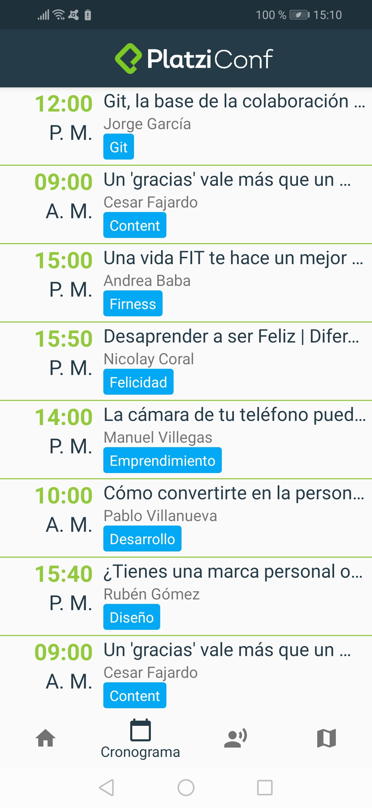
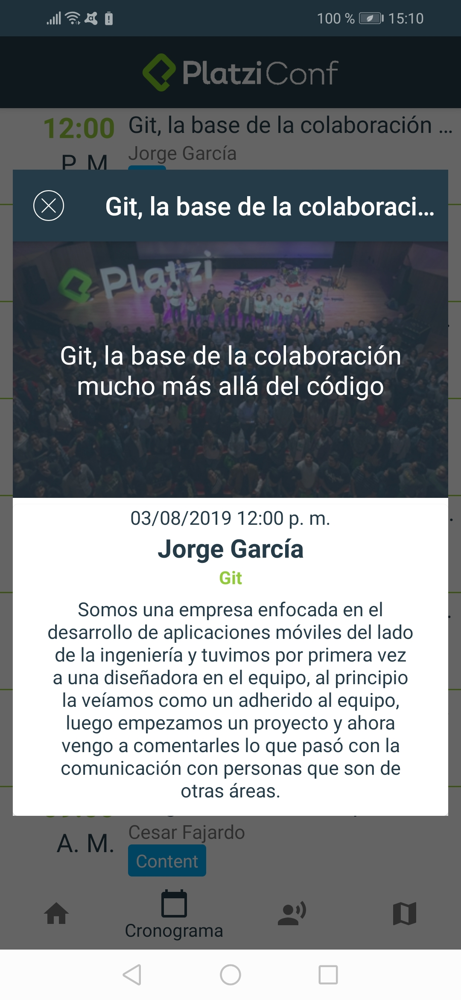
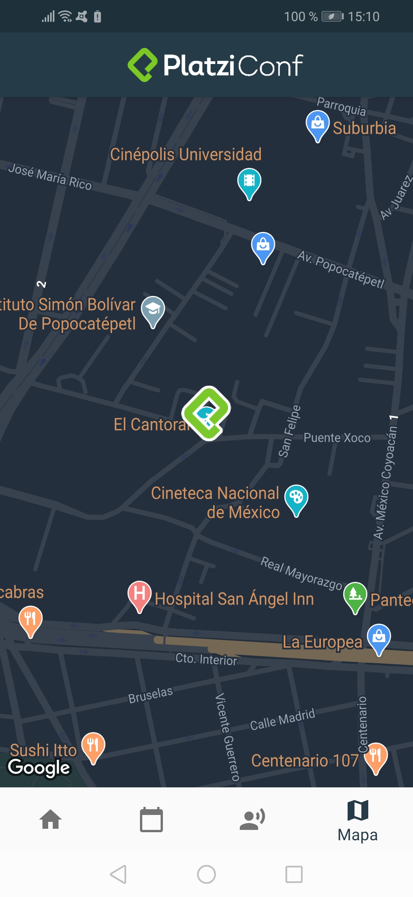
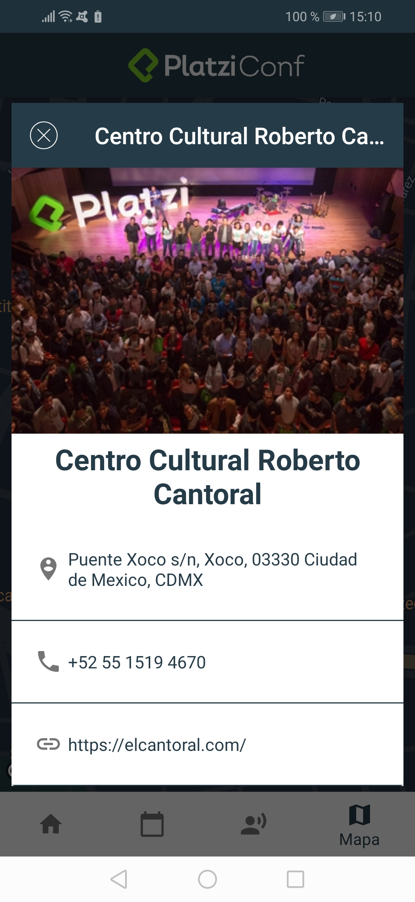

# PlatziConfApp

> Kotlin course project for android on platzi. Aplicación para visualizar la información más importante de Platziconf implementando MVVM (Model-View-View-Model)

##Home

##Schedules

##Schedule Detail

##Speakers

##Speaker Detail

##Ubication Map

##Ubication Detail
